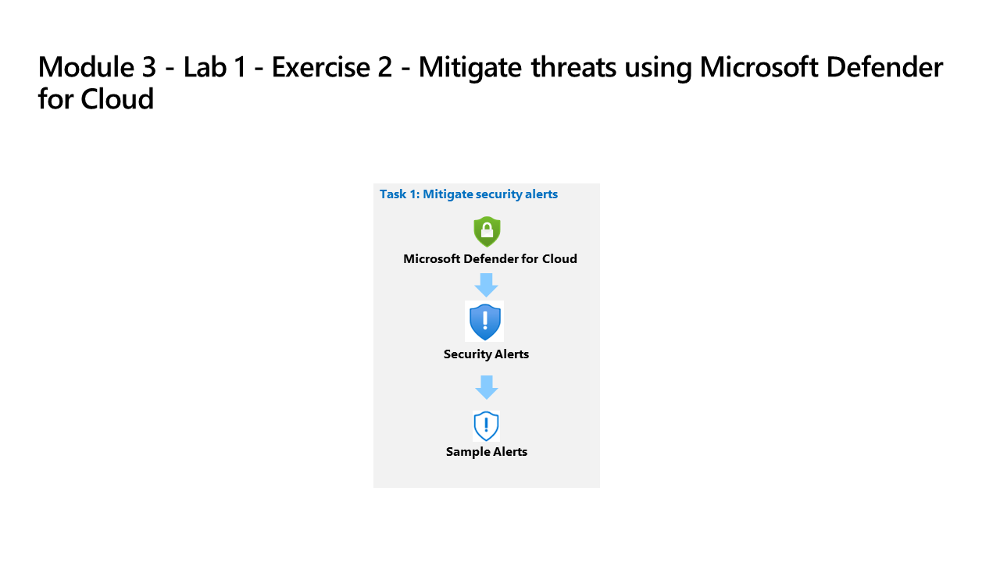

---
lab:
  title: 'Exercício 2: mitigar as ameaças usando o Microsoft Defender para Nuvem'
  module: Learning Path 5 - Mitigate threats using Microsoft Defender for Cloud
---

# Roteiro de aprendizagem 5 – Laboratório 1 – Exercício 2 – Mitigar ameaças usando o Microsoft Defender para Nuvem

## Cenário do laboratório

Você é analista de operações de segurança e trabalha em uma empresa que implementou o Microsoft Defender para Nuvem. Você precisa responder às recomendações e aos alertas de segurança gerados pelo Microsoft Defender para Nuvem.

>**Importante:** os exercícios de laboratório para o Roteiro de Aprendizagem 5 estão em um ambiente *independente*. Se você sair do laboratório antes de concluí-lo, será necessário executar as configurações novamente.

### Tempo estimado para concluir este laboratório: 15 minutos

### Tarefa 1: explorar a conformidade regulatória

Nessa tarefa, você revisará a configuração de conformidade regulamentar no Microsoft Defender para Nuvem. 

>**Importante:** As próximas etapas são feitas em uma máquina diferente daquela que você estava trabalhando anteriormente. Procure as referências de nome da máquina virtual.

1. Faça logon na máquina virtual **WIN1** como Administrador com a senha: **Pa55w.rd**.  

1. No navegador Microsoft Edge, abra o portal do Azure em <https://portal.azure.com>.

1. Na caixa de diálogo **Entrar**, copie e cole na conta **Email do locatário** fornecida pelo provedor de hospedagem de laboratório e selecione **Avançar**.

1. Na caixa de diálogo **Inserir senha**, copie e cole a **Senha de locatário** fornecida pelo provedor de hospedagem do laboratório e selecione **Entrar**.

1. Na barra de pesquisa do portal do Azure, digite *Defender* e selecione **Microsoft Defender para Nuvem**.

1. Em *Segurança na nuvem*, selecione **Conformidade regulatória** nos itens do menu à esquerda.

    >**Observação:** talvez seja necessário atualizar esta página se você não vir as guias da *barra de ferramentas*.

1. Selecione **Gerenciar padrões de conformidade** na barra de ferramentas.

1. Selecione sua assinatura.

    >**Dica:** Selecione **Expandir tudo** para localizar sua assinatura se você tiver uma hierarquia de Grupos de Gerenciamento.

1. Em *Configurações*, selecione **Políticas de segurança** no menu do portal.

1. Role para baixo e revise os "Padrões de segurança" disponíveis por padrão.

1. Use a caixa de pesquisa para localizar a *ISO 27001:2013*.

1. Selecione e mova o controle deslizante de **Status** para a direita da *ISO 27001:2013* para **Ativado**.

    >**Observação:** Alguns padrões exigem que você atribua uma iniciativa do Azure Policy.

1. Selecione **Atualizar** no menu da página para confirmar se *ISO 27001:2013* está definido como *Ativado* para sua assinatura.

1. Feche a página de *Políticas de segurança* selecionando o 'X' no canto superior direito da página para voltar às **Configurações do ambiente**.

    >**Observação:** talvez você queira voltar mais tarde à *Conformidade regulatória* para analisar os novos controles e recomendações padrão.

### Tarefa 2: Explorar recomendações de segurança

Nessa tarefa, você revisará as recomendações de gerenciamento da postura de segurança na nuvem.

1. Na seção *Geral*, selecione **Recomendações** no menu de navegação.

1. Selecione **Adicionar filtro** e depois selecione **Tipo de recurso**.

1. Marque a caixa de seleção **Máquinas - Azure Arc** e selecione o botão **Aplicar**.

    >**Observação:** se você não vir **Máquinas – Azure Arc** listado, atualize a página.

1. Selecione qualquer recomendação cujo status não seja *Concluído*. Talvez seja necessário rolar para a direita para ver a coluna *Status*.

1. Revise a recomendação e na guia **Executar ação** role para baixo até **Delegar** e selecione **Atribuir proprietário e definir data de vencimento**.

1. Na janela **Criar atribuição**, deixe *Tipo* definido como *Microsoft Defender para Nuvem* e expanda os **Detalhes da atribuição**.

1. Na caixa *Endereço de email*, digite o seu email de administrador. **Dica:** você pode copiá-lo nas instruções na guia *Recursos*.

1. Explore as opções de *Definir o período de correção* e *Definir as notificações por email* e selecione **Criar**.

    >**Observação:** se você vir o erro *Falha ao criar atribuições solicitadas*, tente novamente mais tarde.

1. Feche a página de recomendação selecionando o "X" no canto superior direito da janela.

### Tarefa 3: mitigar alertas de segurança

Nessa tarefa, você carregará exemplos de alertas de segurança e revisará os detalhes do alerta.

1. Em *Geral*, selecione **Alertas de segurança** no menu do portal.

1. Selecione **Alertas de amostra** na barra de comandos. **Dica:** talvez seja necessário selecionar o botão de reticências (...) na barra de comandos.

1. No painel Criar alertas de amostra (Visualização), certifique-se de que sua assinatura esteja selecionada e que todos os alertas de amostra estejam selecionados na área de *Planos do Defender para Nuvem*.

1. Selecione **Criar alertas de exemplo**.  

    >**Observação:** este processo de criação de alertas de exemplo pode levar alguns minutos para ser concluído, aguarde até a notificação *"Alertas de exemplo criados com êxito"* aparecer.

1. Depois de concluído, selecione **Atualizar** (se necessário) para ver os alertas exibidos na área *Alertas de segurança*.

1. Escolha um alerta interessante com uma *Severidade* *Alta* e execute as seguintes ações:

    - Selecione a caixa de seleção de alerta e o painel de detalhes do alerta deverá aparecer. Selecione **Exibir detalhes completos**.

    - Revise e leia a guia *Detalhes do alerta*.

    - Selecione a guia **Executar ação** ou role para baixo e selecione o botão **Avançar: Executar ação** no final da página.

    - Revise as informações de *Executar ação*. Observe as seções disponíveis para tomar medidas, dependendo do tipo de alerta: Inspecionar o contexto do recurso, Mitigar a ameaça, Prevenir ataques futuros, Disparar resposta automatizada e Suprimir alertas semelhantes.

## Você concluiu o laboratório
