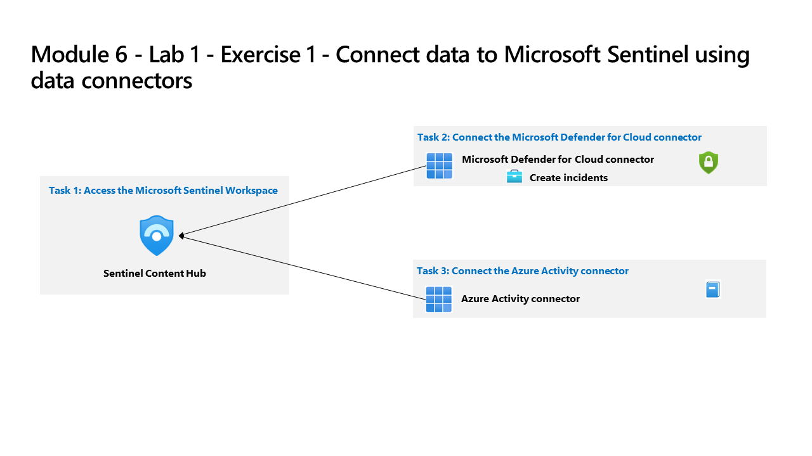

---
lab:
  title: Exercício 1 - Conectar os dados ao Microsoft Sentinel usando conectores de dados
  module: Learning Path 6 - Connect logs to Microsoft Sentinel
---

# Roteiro de Aprendizagem 6 - Laboratório 1 - Exercício 1 - Conectar dados ao Microsoft Sentinel usando conectores de dados

## Cenário do laboratório

Você é um analista de operações de segurança que trabalha em uma empresa que implementou o Microsoft Sentinel. Você deve saber como conectar os dados de log das muitas fontes de dados diferentes na organização. A organização tem dados do Microsoft 365, Microsoft 365 Defender, recursos do Azure, máquinas virtuais não-azure, etc. Você começa a conectar as fontes da Microsoft primeiro.

>**Observação:** uma **[simulação interativa de laboratório](https://mslabs.cloudguides.com/guides/SC-200%20Lab%20Simulation%20-%20Connect%20data%20to%20Microsoft%20Sentinel%20using%20data%20connectors)** está disponível, permitindo a você clicar neste laboratório no seu próprio ritmo. Você pode encontrar pequenas diferenças entre a simulação interativa e o laboratório hospedado, mas os principais conceitos e ideias que estão sendo demonstrados são os mesmos. 

### Tarefa 1: acessar o Workspace do Microsoft Sentinel

Nesta tarefa, você acessará seu workspace do Microsoft Sentinel.

1. Faça login na máquina virtual **WIN1** como Admin com a senha: **Pa55w.rd**.  

1. Abra o navegador Microsoft Edge.

1. No navegador Edge, acesse o portal do Azure em https://portal.azure.com.

1. Na caixa de diálogo **Entrar**, copie e cole na conta **Email do Locatário** fornecida pelo provedor de hospedagem de laboratório e selecione **Avançar**.

1. Na caixa de diálogo **Inserir senha**, copie e cole a **Senha do Locatário** fornecida pelo provedor de hospedagem de laboratório e selecione **Entrar**.

1. Na barra de Pesquisa do portal do Azure, digite *Sentinel* e selecione **Microsoft Sentinel**.

1. Selecione o seu workspace do Microsoft Sentinel que você criou no laboratório anterior.

1. No menu de navegação, selecione Análise.

1. Selecione *Criar incidentes com base no Microsoft Defender para Nuvem* nos modelos de regra.

1. Selecione **Criar regra** na folha de informações do conector.

1. No assistente de regras de Análise, selecione **Avançar: resposta automatizada** e selecione **Avançar: revisar e criar**.

1. Selecione **Salvar**.

### Tarefa 2: conectar o conector de dados do Microsoft Defender para Nuvem

Nesta tarefa, você conectará o conector de dados do Microsoft Defender para Nuvem.

1. No menu esquerdo do Microsoft Sentinel, role para baixo até a seção *Gerenciamento de conteúdo* e selecione **Hub de Conteúdos**.

1. No *Hub de conteúdo*, procure a solução **Microsoft Defender para Nuvem** e selecione-a na lista.

1. Na página da solução *Microsoft Defender para Nuvem *, selecione **Instalar**.

1. Após a instalação, selecione **Gerenciar**

    >**Observação:** a solução *Microsoft Defender para Nuvem* instala o conector de dados do *Microsoft Defender para Nuvem (Herdado) baseado em assinatura*, o conector de dados do *Microsoft Defender para Nuvem (Versão preliminar) baseado em locatário* e uma regra de Análise.

1. Selecione a caixa de seleção Conector de dados do *Microsoft Defender para Nuvem (Herdado) baseado em assinatura* e selecione a **página Abrir conector**.

1. Na seção *Configuração*, na guia *Instruções*,** marque** a caixa de seleção da assinatura "Azure Pass - Patrocínio" e deslize a opção **Status** para a direita.

    >**Observação:** se ele voltar para desconectado, revise o Roteiro de Aprendizagem 3, Exercício 1, Tarefa 1 para atribuir as permissões adequadas à sua conta.

1. O *Status* agora deve ser **Conectado** e "Sincronização bidirecional" deve estar *Habilitada*.

1. Role para baixo e, na área *Criar incidentes - Recomendado!*, verifique se *Criar incidentes automaticamente a partir de todos os alertas gerados nesse serviço conectado* está **Ativado**.

### Tarefa 3: conectar o conector de dados da Atividade do Azure

Nesta tarefa, você conectará o conector de dados de *Atividade do Azure*.

1. No menu esquerdo do Microsoft Sentinel, role para baixo até a seção *Gerenciamento de conteúdo* e selecione **Hub de Conteúdos**.

1. No *hub de conteúdos*, procure a solução de **Atividade do Azure** e selecione-a na lista.

1. Na página da solução de *Atividade do Azure*, selecione **Instalar**.

1. Após a instalação, selecione **Gerenciar**

    >**Observação:** a solução *Atividade do Azure* instala o conector de dados *Atividade do Azure*, 12 regras de Análise, 14 consultas de busca e 1 Pasta de Trabalho.

1. Selecione o conector de dados de *Atividade do Azure* e depois **Abrir página do conector**.

1. Na área *Configuração*, na guia *Instruções*, role a página para baixo até "2. Conecte suas assinaturas..." e selecione **Iniciar Assistente de Atribuição do Azure Policy>**.

1. Na guia **Básico**, selecione o botão de reticências (...) em **Escopo** e selecione sua assinatura "Azure Pass – Patrocínio" na lista suspensa e clique em **Selecionar**.

1. Selecione a guia **Parâmetros**, escolha o workspace *uniquenameDefender* na lista suspensa **Workspace principal do Log Analytics**. Essa ação aplicará a configuração de assinatura para enviar as informações para o workspace do Log Analytics.

1. Selecione a guia **Correção** e marque a caixa de seleção **Criar uma tarefa de correção**. Essa ação aplicará a de política a recursos já existentes do Azure.

1. Selecione o botão **Examinar + criar** para examinar a configuração.

1. Selecione **Criar** para concluir.

## Prossiga para o Exercício 2
