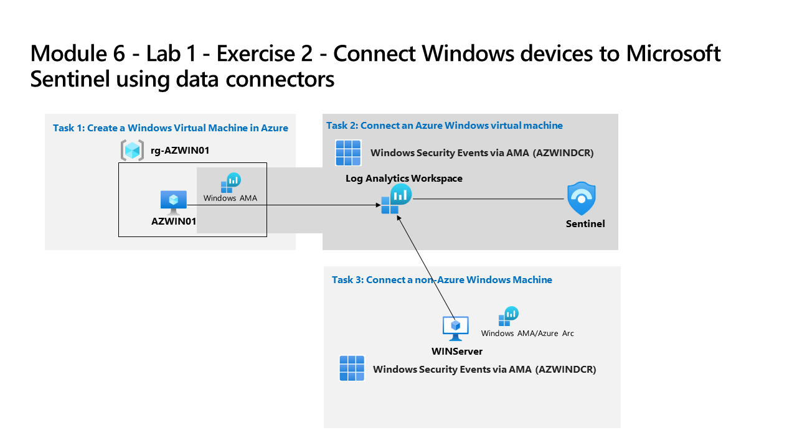

---
lab:
  title: 'Exercício 2: conectar dispositivos Windows ao Microsoft Sentinel usando conectores de dados'
  module: Learning Path 6 - Connect logs to Microsoft Sentinel
---

# Roteiro de aprendizagem 6, Laboratório 1, Exercício 2: conectar dispositivos Windows ao Microsoft Sentinel usando conectores de dados

## Cenário do laboratório

Você é um analista de operações de segurança que trabalha em uma empresa que implementou o Microsoft Sentinel. Você deve saber como conectar os dados de log de várias fontes de dados na organização. A próxima fonte de dados são máquinas virtuais do Windows dentro e fora do Azure, como ambientes locais ou outras nuvens públicas.

>**Observação:** uma **[simulação de laboratório interativa](https://mslabs.cloudguides.com/guides/SC-200%20Lab%20Simulation%20-%20Connect%20Windows%20devices%20to%20Microsoft%20Sentinel%20using%20data%20connectors)** está disponível e permite que você clique neste laboratório no seu próprio ritmo. Você pode encontrar pequenas diferenças entre a simulação interativa e o laboratório hospedado, mas os principais conceitos e ideias que estão sendo demonstrados são os mesmos. 

### Tarefa 1: criar uma máquina virtual do Windows no Azure

Nesta tarefa, você criará uma máquina virtual do Windows no Azure.

1. Faça logon na máquina virtual **WIN1** como Administrador com a senha: **Pa55w.rd**.  

1. No navegador Microsoft Edge, acesse o portal do Azure em https://portal.azure.com.

1. Na caixa de diálogo **Entrar**, copie e cole na conta **Email do locatário** fornecida pelo provedor de hospedagem de laboratório e selecione **Avançar**.

1. Na caixa de diálogo **Inserir senha**, copie e cole a **Senha de locatário** fornecida pelo provedor de hospedagem do laboratório e selecione **Entrar**.

1. Selecione **+ Criar um Recurso**. **Dica:** se você já estiver no Portal do Azure, talvez seja necessário selecionar *Microsoft Azure* na barra superior para ir para a página inicial.

1. Na caixa **Pesquisar serviços e marketplace**, insira *Windows 10* e selecione **Microsoft Windows 10** na lista suspensa.

1. Selecione a caixa para **Microsoft Windows 10**.

1. Abra a lista suspensa *Plano* e selecione **Windows 10 Enterprise, versão 22H2**.

1. Selecione **Iniciar com uma configuração predefinida** para continuar.

1. Selecione **Desenvolvimento/Teste** e, em seguida, selecione **Continuar para criar uma VM**.

1. Selecione **Criar novo** para o *Grupo de recursos*, insira RG-AZWIN01 como Nome e selecione **OK**.

    >**Observação:** esse será um novo grupo de recursos para fins de acompanhamento. 

1. Em *Nome da máquina virtual*, insira AZWIN01.

1. Mantenha **(EUA) Leste dos EUA** como valor padrão para *Região*.

1. Role para baixo e revise a *imagem* da máquina virtual. Se ele estiver vazio, selecione **Windows 10 Enterprise, versão 22H2**.

1. Revise o *Tamanho* da máquina virtual. Se ele estiver vazio, selecione **Ver todos os tamanhos**, escolha o primeiro tamanho de VM em *Mais usado pelos usuários do Azure* e clique em **Selecionar**.

    >**Observação:** se você vir a mensagem *Esta imagem não tem suporte para Gerenciamento automatizado do Azure. Para desabilitar esse recurso, navegue até a guia Gerenciamento. Caso contrário, selecione uma imagem com suporte.* Vá para a guia Gerenciamento e desabilite "Gerenciamento automatizado". O processo de criação progredirá depois.

1. Role para baixo e insira um *Nome de usuário* de sua escolha. **Dica:** Evite palavras reservadas como "admin" (administrador) ou "root" (raiz).

1. Insira uma *senha* de sua escolha. **Dica:** pode ser mais fácil reutilizar sua senha de locatário. Ele pode ser encontrado na guia Recursos.

1. Role para baixo até a parte inferior da página e marque a caixa de seleção abaixo de *Licenciamento* para confirmar que você tem a licença qualificada.

1. Selecione **Examinar + criar** e aguarde até que a validação seja aprovada.

    >**Observação:** se houver uma falha de validação de *Sistema de rede*, selecione essa guia, revise seu conteúdo e depois selecione **Examinar + criar** novamente.

1. Selecione **Criar**. Aguarde até que o recurso seja criado, o que pode levar alguns minutos.

### Tarefa 2: conectar uma máquina virtual do Windows do Azure

Nesta tarefa, você conectará uma máquina virtual do Windows do Azure ao Microsoft Sentinel.

1. Na barra de Pesquisa do portal do Azure, digite *Sentinel* e selecione **Microsoft Sentinel**.

1. Selecione o workspace do Microsoft Sentinel que você criou anteriormente.

1. 1. No menu esquerdo do Microsoft Sentinel, role para baixo até a seção *Gerenciamento de conteúdo* e selecione **Hub de conteúdos**.

1. No *Hub de conteúdo*, procure a solução **Eventos de Segurança do Windows** e selecione-a na lista.

1. Na página da solução *Eventos de Segurança do Windows*, selecione **Instalar**.

1. Quando a instalação for concluída, selecione **Gerenciar**

    >**Observação:** A solução *Eventos de Segurança do Windows* instala os conectores de dados *Eventos de Segurança do Windows via AMA* e *Eventos de Segurança via agente herdado*. Mais 2 pastas de trabalho, 20 regras de análise e 43 consultas de busca.

1. Selecione o conector de dados *Eventos de Segurança do Windows via AMA* e selecione **Abrir página do conector** na folha de informações do conector.

1. Na seção *Configuração*, na guia *Instruções*, selecione a opção **Criar regra de coleta de dados**.

1. Insira **AZWINDCR** para Nome da regra e depois selecione **Avançar: Recursos**.

1. Selecione **+Adicionar recurso(s)** para selecionar a Máquina Virtual que criamos.

1. Expanda **RG-AZWIN01** e selecione **AZWIN01**.

1. Selecione **Aplicar** e depois **Avançar: Coletar**.

1. Revise a opção de coleta diferente de Evento de Segurança. Manter *Todos os Eventos de Segurança* e selecione **Avançar: Examinar + criar**.

1. Selecione **Criar** para salvar uma regra de coleta de dados.

1. Aguarde um minuto e selecione **Atualizar** para ver a nova regra de coleta de dados listada.

### Tarefa 3: conectar uma máquina virtual Windows que não seja do Azure

Nesta tarefa, você adicionará uma máquina virtual Windows que não seja do Azure conectada ao Azure Arc ao Microsoft Sentinel.  

   >**Observação:** o conector de dados *Eventos de Segurança do Windows via AMA* exige o Azure Arc para dispositivos que não sejam do Azure.

1. Verifique se você está na configuração do conector de dados *Eventos de Segurança do Windows via AMA* em seu workspace do Microsoft Sentinel.

1. Na guia **Instruções**, na seção *Configuração*, edite a *regra de coleta de dados* **AZWINDCR** selecionando o ícone de *lápis*.

1. Selecione **Avançar: Recursos** e expanda sua *Assinatura* em *Escopo* na guia *Recursos*.

    >**Dica:** Você pode expandir toda a hierarquia *Escopo* selecionando o ">" antes da coluna *Escopo*.

1. Expanda o **RG-Defender** (ou o Grupo de recursos que você criou) e selecione **WINServer**.

    >**Importante:** Se você não vir o WINServer, consulte o Roteiro de aprendizagem 3, Exercício 1 e Tarefa 4 onde você instalou o Azure Arc neste servidor.

1. Selecione **Aplicar**.

1. Selecione **Avançar: Coletar**, depois **Avançar: Examinar + criar**.

1. Depois que a mensagem *Validação aprovada* for exibida, selecione **Criar**.

## Prossiga para o Exercício 3
