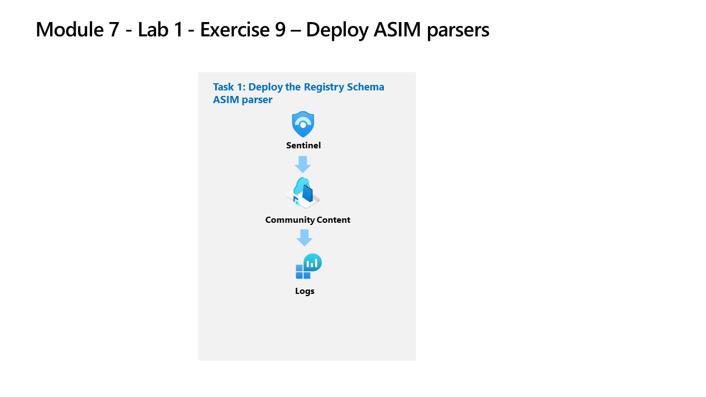

---
lab:
  title: 'Exercício 9: criar analisadores ASIM'
  module: Learning Path 7 - Create detections and perform investigations using Microsoft Sentinel
---

# Roteiro de aprendizagem 7, Laboratório 1, Exercício 9: implantar analisadores ASIM

## Cenário do laboratório

Você é um analista de operações de segurança que trabalha em uma empresa que implementou o Microsoft Sentinel. Você precisa modelar analisadores ASIM para um evento de registro específico do Windows. Esses analisadores simplificados serão finalizados posteriormente após a [referência do esquema de normalização de eventos do Registro ASIM (Advanced Security Information Model)](https://docs.microsoft.com/en-us/azure/sentinel/registry-event-normalization-schema).

>**Observação:** uma **[simulação de laboratório interativa](https://mslabs.cloudguides.com/guides/SC-200%20Lab%20Simulation%20-%20Create%20Advanced%20Security%20Information%20Model%20Parsers)** está disponível e permite que você clique neste laboratório no seu próprio ritmo. Você pode encontrar pequenas diferenças entre a simulação interativa e o laboratório hospedado, mas os principais conceitos e ideias que estão sendo demonstrados são os mesmos. 

### Tarefa 1: Implantar os analisadores ASIM do esquema de registro

Nesta tarefa, você implantará os analisadores do Esquema de registro por meio do repositório GitHub do Microsoft Sentinel.

1. Faça logon na máquina virtual WIN1 como Administrador com a senha: **Pa55w.rd**.  

1. No navegador Edge, acesse o portal do Azure em https://portal.azure.com.

1. Na caixa de diálogo **Entrar**, copie e cole a conta de **email do locatário** fornecida pelo provedor de hospedagem do laboratório e selecione **Avançar**.

1. Na caixa de diálogo **Inserir senha**, copie e cole a **Senha de locatário** fornecida pelo provedor de hospedagem do laboratório e selecione **Entrar**.

1. Na barra de Pesquisa do portal do Azure, digite *Sentinel* e selecione **Microsoft Sentinel**.

1. Selecione o workspace do Microsoft Sentinel que você criou anteriormente.

1. No navegador Edge, abra uma nova guia (Ctrl+T) e navegue até a página do ASIM do Microsoft Sentinel no GitHub <https://github.com/Azure/Azure-Sentinel/tree/master/ASIM>.

    <!--- 1. On the right pane, select the **Onboard community content** link. This will open a new tab in the Edge Browser for Microsoft Sentinel GitHub content. **Hint:** You might need to scroll right to see the link. Alternatively, follow this link instead: [Microsoft Sentinel on GitHub](https://github.com/Azure/Azure-Sentinel). --->

    >**Observação:** Na pasta do **ASIM**, você pode implantar modelos que contêm todos os analisadores ASIM, mas nos concentraremos apenas no Esquema do registro.

1. Role para baixo e, ao lado de **Registro**, clique no botão **Implantar no Azure**.

1. Em *Grupo de recursos*, selecione **RG-Defender**, onde está o workspace do Sentinel.

1. Em *Workspace*, digite o nome do workspace do Sentinel, como *uniquenameDefender*.

1. Mantenha os outros valores padrão e selecione **Examinar + criar**.

1. Selecione **Criar** para implantar o modelo. Observe os nomes dos diferentes recursos.

1. Após a conclusão da implantação, retorne à guia *Microsoft Sentinel*.

1. Selecione **Logs** no menu esquerdo *Geral*.

1. Abra a folha *Esquema e filtro* selecionando **>>**, se necessário.

1. Selecione a guia **Funções** (ao lado das guias Tabelas e Consultas). **Dica:** talvez seja necessário selecionar o ícone de reticências **(...)** para selecionar a guia.

1. Expanda **Funções do workspace**. Observe que os nomes correspondem aos modelos que você acabou de implantar.

1. Passe o mouse sobre o *analisador de workspace* **vimRegistryEventMicrosoftSecurityEvents** e selecione **Carregar o código da função** na janela pop-up.

1. Revise o KQL que está analisando o ID de evento 4657 para simplificar sua análise dos dados no workspace do Microsoft Sentinel.

1. **Execute** a consulta. Você não deve obter resultados nem erros, é apenas para fins de validação.

1. Volte para a folha *Esquema e filtro* e, agora, passe o mouse sobre o *analisador unificador* **inRegistry** e selecione **Carregar o código da função**.

1. Observe que os analisadores unificadores usam o operador *union* para executar todos os analisadores de workspace de uma só vez. Se você desenvolver um analisador para o Esquema do registro, será necessário adicioná-lo aqui.

1. **Execute** a consulta. Você não deve obter nenhum resultado ou erro, pois isso serve apenas para fins de validação.

1. Esse analisador unificador agora pode ser usado para Regras analíticas ou Consultas de busca.

## Prossiga para o Exercício 10