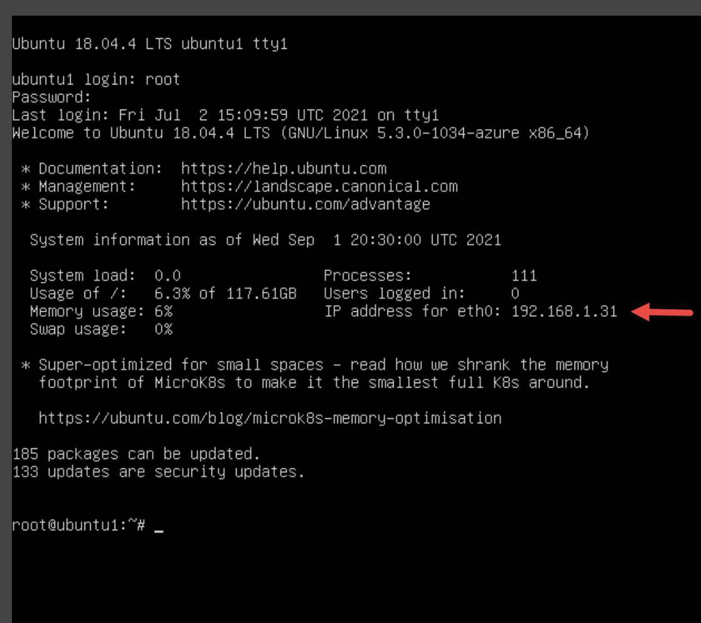

---
lab:
  title: 'Exercício 3: conectar hosts Linux ao Microsoft Sentinel usando conectores de dados'
  module: Learning Path 8 - Connect logs to Microsoft Sentinel
---

# Roteiro de aprendizagem 8 — Laboratório 1 — Exercício 3 — Conectar hosts Linux ao Microsoft Sentinel usando conectores de dados

## Cenário do laboratório


Você é um analista de operações de segurança que trabalha em uma empresa que implementou o Microsoft Sentinel. Você deve saber como conectar os dados de log de várias fontes de dados na organização. A próxima fonte de dados são máquinas virtuais do Linux que usam o Formato comum de evento (CEF) por meio de conectores Agente herdado e Syslog.

>**Importante:** os exercícios de laboratório para o Roteiro de Aprendizagem 8 estão em um ambiente *independente*. Se você sair do laboratório antes de concluí-lo, será necessário executar as configurações novamente.

### Tempo estimado para concluir este laboratório: 30 minutos

>**Importante:** há etapas nas próximas Tarefas que são feitas em máquinas virtuais diferentes. Procure as referências de nome da máquina virtual.

### Tarefa 1: acessar o workspace do Microsoft Sentinel

Nesta tarefa, você acessará seu workspace do Microsoft Sentinel.

>**Observação:** o Microsoft Sentinel foi pré-implantado em sua assinatura do Azure com o nome **defenderWorkspace** e as soluções necessárias do *Hub de Conteúdo* foram instaladas.

1. Faça logon na máquina virtual **WIN1** como Administrador com a senha: **Pa55w.rd**.  

1. Inicie o navegador Microsoft Edge.

1. No navegador Edge, acesse o portal do Azure em <https://portal.azure.com>.

1. Na caixa de diálogo **Entrar**, copie e cole na conta **Email do locatário** fornecida pelo provedor de hospedagem de laboratório e selecione **Avançar**.

1. Na caixa de diálogo **Inserir senha**, copie e cole a **Senha de locatário** fornecida pelo provedor de hospedagem do laboratório e selecione **Entrar**.

1. Na barra de Pesquisa do portal do Azure, digite *Sentinel* e selecione **Microsoft Sentinel**.

1. Selecione o **defenderWorkspace** do Microsoft Sentinel.

### Tarefa 2: conectar um host Linux usando o conector Formato comum de evento

Nesta tarefa, você conectará um host Linux ao Microsoft Sentinel com o Formato comum de evento (CEF) por meio do conector Agente herdado.

1. No menu esquerdo do Microsoft Sentinel, role para baixo até a seção *Gerenciamento de conteúdo* e selecione **Hub de conteúdos**.

1. No *Hub de conteúdo*, procure a solução **Formato comum de evento** e selecione-a na lista.

1. Na página da solução *Formato comum de evento*, selecione **Gerenciar**.

    >**Observação:** a solução *Formato comum de evento* instala os conectores de dados *Formato de evento comum (CEF) por meio do AMA* e o *Formato comum de evento (CEF)*.

1. Selecione o conector de dados *Formato Comum de Evento (CEF) via AMA* e selecione **Abrir página do conector** na folha de informações do conector.

1. Na seção *Configuração*, na guia *Instruções*, copie para a área de transferência o comando mostrado em *1.2 Instalar o coletor CEF na máquina Linux*.

1. Inicie sua máquina virtual **LIN1**. Faça logon com o nome de usuário e senha fornecidos pelo host do seu laboratório. **Dica:** talvez seja necessário pressionar a tecla Enter para ver o prompt de logon.

1. Anote o endereço IP do servidor LIN1. Veja a captura de tela abaixo como um exemplo:

    

1. Vá até a máquina virtual **WIN1**. Inicie o Windows PowerShell digitando **Windows PowerShell** no formulário Pesquisar na barra de tarefas e selecione **Windows PowerShell**.

1. Insira o seguinte comando do PowerShell, ajustando-o às informações específicas do seu servidor Linux, e pressione Enter:

    ```PowerShell
    ssh insert-your-linux-IP-address-here -l insert-linux-user-name-here
    ```

1. Insira *sim* para confirmar a conexão e, em seguida, insira a senha do usuário e pressione Enter. Sua tela deve ser semelhante a esta:

    

1. Agora você consegue colar o comando *1.2 Instalar o coletor CEF na máquina Linux* da etapa anterior. Verifique se o script do Azure está na área de transferência. No PowerShell, clique com o botão direito do mouse na barra superior e escolha **Editar** e depois **Colar**. 

1. Uma vez colado e antes de pressionar Enter, adicione o caractere **3** à palavra *python* como mostrado abaixo:

    


1. Depois que o script for ajustado, pressione Enter. O script será executado remotamente em seu servidor Linux. Quando o script é processado corretamente, ele deve se parecer com esta tela:

    

1. Digite **sair** para fechar a conexão do shell remoto com LIN1.


### Tarefa 3: conectar um host Linux usando o conector Syslog

Nesta tarefa, você conectará um host Linux ao Microsoft Sentinel com o conector Syslog.

1. Volte para o navegador Microsoft Edge onde você tem o Portal do Microsoft Sentinel aberto e feche a página do conector de dados "Formato comum de evento (CEF) por meio do Agente herdado" selecionando o "x" no canto superior direito.

1. No menu esquerdo do Microsoft Sentinel, role para baixo até a seção *Gerenciamento de conteúdo* e selecione **Hub de conteúdos**.

1. No *Hub de conteúdo*, procure a solução de **Syslog** e selecione-a na lista.

1. Na página da solução *Syslog*, selecione **Gerenciar**.

    >**Observação:** a solução de *Syslog* instala o conector de dados de *Syslog*, 5 regras de análise, 9 consultas de busca e 1 pasta de trabalho.

1. Selecione o conector de dados *Syslog* e selecione **Abrir página do conector** na folha de informações do conector

1. Na seção *Configuração*, expanda **Instalar agente em uma máquina Linux que não seja do Azure**.

1. Selecione o link **Baixar e instalar o agente para máquinas Linux que não sejam do Azure**.

    >**Observação:** seu workspace do Log Analytics deve mostrar *2 computadores Windows conectados*. Isso corresponde às máquinas virtuais WINServer e AZWIN01 conectadas anteriormente.

1. Selecione a guia para **Servidores Linux**.

    >**Observação:** seu workspace do Log Analytics deve mostrar *1 computador Windows conectado*. Isso corresponde à máquina virtual LIN1 (ubuntu1) conectada anteriormente com o conector CEF.

1. Selecione **Instruções do agente do Log Analytics**.

1. Copie o comando na área *Baixar e integrar o agente para Linux* para a área de transferência.

1. Inicie sua máquina virtual LIN2. Faça logon com o nome de usuário e senha fornecidos pelo host do seu laboratório. **Dica:** talvez seja necessário pressionar a tecla Enter para ver o prompt de logon.

1. Anote o endereço IP do servidor LIN2. Veja a captura de tela abaixo como um exemplo:

    

1. Vá até a máquina virtual **WIN1**. Selecione o Windows PowerShell usado na tarefa anterior.

1. Insira o seguinte comando do PowerShell, ajustando-o às informações específicas do seu servidor Linux, e pressione Enter:

    ```PowerShell
    ssh insert-your-linux-IP-address-here -l insert-linux-user-name-here
    ```

1. Insira *sim* para confirmar a conexão e, em seguida, insira a senha do usuário e pressione Enter. Sua tela deve ser semelhante a esta:

    

1. Agora você consegue colar o comando *Baixar e integrar o agente para Linux* da etapa anterior. Certifique-se de que o script esteja na área de transferência. No PowerShell, clique com o botão direito do mouse na barra superior e escolha **Editar** e depois **Colar**.

1. Depois de colar o script, pressione Enter. O script será executado remotamente em seu servidor Linux. Aguardar

1. Depois de concluir, digite **sair** para fechar a conexão do shell remoto com LIN2.

### Tarefa 4: configurar as instalações que deseja coletar e suas respectivas severidades para o conector Syslog

Nesta tarefa, você configurará as instalações de coleta do Syslog.

1. Volte para o navegador Edge onde você tem o Portal do Microsoft Sentinel aberto e feche a página "Workspace do Log Analytics" e a página do conector de dados "Syslog" selecionando o "x" no canto superior direito duas vezes.

1. No portal do Microsoft Sentinel, selecione **Configurações** em *Configuração* e, em seguida, selecione a guia **Configurações do workspace**.

1. Selecione **Gerenciamento de agentes herdados** na área *Clássico*.

1. Selecione a guia **Syslog**.

1. Clique no botão **+ Adicionar instalação**.

1. Selecione **auth** no menu suspenso para *Nome da instalação*.

1. Clique no botão **+ Adicionar instalação** novamente.

1. Selecione **syslog** no menu suspenso para *Nome da instalação*.

1. Selecione **Aplicar** para salvar as alterações.

## Prossiga para o Exercício 4
