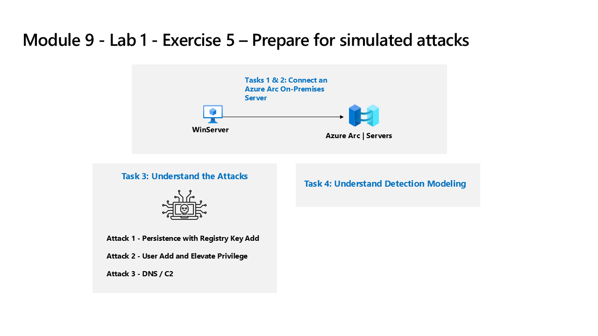

---
lab:
  title: Exercício 5 – Preparar-se para realizar ataques simulados
  module: Learning Path 9 - Create detections and perform investigations using Microsoft Sentinel
---

# Roteiro de Aprendizagem 9 – Laboratório 1 – Exercício 5 – Preparar-se para realizar ataques simulados

## Cenário do laboratório



### Tempo estimado para concluir este laboratório: 30 minutos

### Tarefa 1: Conectar-se a um servidor local

Nesta tarefa, você conectará um servidor local à sua assinatura do Azure. O Azure Arc foi pré-instalado neste servidor. O servidor será usado nos próximos exercícios para executar ataques simulados que você irá detectar e investigar posteriormente no Microsoft Sentinel.

>**Observação:** os exercícios de laboratório do Roteiro de Aprendizagem 9 estão em um ambiente *independente*. Se você sair do laboratório antes de concluí-lo, será necessário executar as configurações novamente.

1. Faça logon na máquina virtual **WINServer** como Administrador com a senha: **Passw0rd!** Se necessário.  

Conforme descrito acima, o Azure Arc foi pré-instalado na máquina **WINServer**. Agora você conectará essa máquina à sua assinatura do Azure.

1. No computador *WINServer*, clique no ícone de *pesquisa* e digite **cmd**.

1. Nos resultados da pesquisa, clique com o botão direito do mouse em *Prompt de Comando* e selecione **Executar como administrador**.

1. Na janela do Prompt de comando, digite o seguinte comando. *Não pressione Enter*:

    ```cmd
    azcmagent connect -g "defender-RG" -l "EastUS" -s "Subscription ID string"
    ```

1. Substitua a **cadeia de caracteres da ID da assinatura** pela *ID da assinatura* fornecida pelo host do laboratório (*guia Recursos). Certifique-se de manter as aspas.

1. Digite **Enter** para executar o comando (isso pode levar alguns minutos).

1. Na caixa de diálogo *Entrar*, digite o **Email do locatário** e a **Senha do locatário** fornecida pelo provedor de hospedagem do laboratório e clique em **Entrar**. Aguarde a mensagem *Autenticação concluída*, feche a guia do navegador e retorne à janela do *Prompt de comando*.

1. Quando os comandos concluírem a execução, deixe a janela do *Prompt de comando* aberta e digite o seguinte comando para confirmar se a conexão ocorreu:

    ```cmd
    azcmagent show
    ```

1. Na saída do comando, verifique se o *Status do agente* é **Conectado**.

## Tarefa 2: Conectar uma máquina Windows que não seja do Azure

Nesta tarefa, você adicionará uma máquina local conectada do Azure Arc ao Microsoft Sentinel.  

>**Observação:** o Microsoft Sentinel foi pré-implantado em sua assinatura do Azure com o nome **defenderWorkspace** e as soluções necessárias do *Hub de Conteúdo* foram instaladas.

1. Faça logon na máquina virtual **WIN1** como Administrador com a senha: **Pa55w.rd**.  

1. No navegador Microsoft Edge, acesse o portal do Azure em <https://portal.azure.com>.

1. Na caixa de diálogo **Entrar**, copie e cole na conta **Email do locatário** fornecida pelo provedor de hospedagem de laboratório e selecione **Avançar**.

1. Na caixa de diálogo **Inserir senha**, copie e cole a **Senha de locatário** fornecida pelo provedor de hospedagem do laboratório e selecione **Entrar**.

1. Na barra de Pesquisa do portal do Azure, digite *Sentinel* e selecione **Microsoft Sentinel**.

1. Selecione o **defenderWorkspace** do Microsoft Sentinel.

1. No menu de navegação à esquerda do Microsoft Sentinel, role para baixo até a seção *Configuração* e selecione **Conectores de dados**.

1. Nos *Conectores de dados*, procure a solução **Eventos de Segurança do Windows por meio do AMA** e selecione-a na lista.

1. No painel de detalhes dos *Eventos de Segurança do Windows por meio do AMA*, selecione **Abrir página do conector**.

    >**Observação:** A solução *Eventos de Segurança do Windows* instala os conectores de dados *Eventos de Segurança do Windows via AMA* e *Eventos de Segurança via agente herdado*. Mais 2 pastas de trabalho, 20 regras de análise e 43 consultas de busca.

1. Na seção *Configuração*, na guia *Instruções*, selecione a opção **Criar regra de coleta de dados**.

1. Insira **AZWINDCR** para Nome da regra e depois selecione **Avançar: Recursos**.

1. Expanda sua *Assinatura* em *Escopo* na *guia Recursos*.

    >**Dica:** Você pode expandir toda a hierarquia *Escopo* selecionando o ">" antes da coluna *Escopo*.

1. Expanda o grupo de recursos **defender-RG** e selecione **WINServer**.

1. Selecione **Avançar: Coletar** e deixe *Todos os eventos de segurança* selecionado.

1. Selecione **Avançar: Revisar + criar**.

1. Depois que a mensagem *Validação aprovada* for exibida, selecione **Criar**.

### Tarefa 3: Entender os ataques

>**Importante: você não executará nenhuma ação neste exercício.**  Estas instruções são apenas uma explicação dos ataques que você realizará no próximo exercício. Leia atentamente esta página.

Os padrões de ataque são baseados em um projeto de código aberto: <https://github.com/redcanaryco/atomic-red-team>

#### Ataque 1: persistência com adição de chave do Registro

Os invasores adicionarão um programa na chave do Registro Executar. Isso alcança a persistência, fazendo com que o programa seja executado toda vez que o usuário fizer logon.

```
REG ADD "HKCU\SOFTWARE\Microsoft\Windows\CurrentVersion\Run" /V "SOC Test" /t REG_SZ /F /D "C:\temp\startup.bat"
```

#### Ataque 2: adição de usuário e elevação de privilégio

Os invasores adicionarão novos usuários e elevarão o novo usuário ao grupo Administradores. Isso permite que o invasor faça logon com uma conta diferente que seja privilegiada.

```
net user theusernametoadd /add
net user theusernametoadd ThePassword1!
net localgroup administrators theusernametoadd /add
```

#### Ataque 3: DNS/C2

O invasor enviará um grande volume de consultas de DNS a um servidor de comando e controle (C2). A intenção é disparar a detecção baseada em limites no número de consultas de DNS de um único sistema de origem ou para um único domínio de destino.

```
param(
    [string]$Domain = "microsoft.com",
    [string]$Subdomain = "subdomain",
    [string]$Sub2domain = "sub2domain",
    [string]$Sub3domain = "sub3domain",
    [string]$QueryType = "TXT",
        [int]$C2Interval = 8,
        [int]$C2Jitter = 20,
        [int]$RunTime = 240
)
$RunStart = Get-Date
$RunEnd = $RunStart.addminutes($RunTime)
$x2 = 1
$x3 = 1 
Do {
    $TimeNow = Get-Date
    Resolve-DnsName -type $QueryType $Subdomain".$(Get-Random -Minimum 1 -Maximum 999999)."$Domain -QuickTimeout
    if ($x2 -eq 3 )
    {
        Resolve-DnsName -type $QueryType $Sub2domain".$(Get-Random -Minimum 1 -Maximum 999999)."$Domain -QuickTimeout
        $x2 = 1
    }
    else
    {
        $x2 = $x2 + 1
    }
    if ($x3 -eq 7 )
    {
        Resolve-DnsName -type $QueryType $Sub3domain".$(Get-Random -Minimum 1 -Maximum 999999)."$Domain -QuickTimeout
        $x3 = 1
    }
    else
    {
        $x3 = $x3 + 1
    }
    $Jitter = ((Get-Random -Minimum -$C2Jitter -Maximum $C2Jitter) / 100 + 1) +$C2Interval
    Start-Sleep -Seconds $Jitter
}
Until ($TimeNow -ge $RunEnd)
```

### Tarefa 4: Entender a modelagem de detecção

O ciclo de configuração de detecção de ataque usado neste laboratório representa todas as fontes de dados, mesmo que você esteja focado apenas em duas fontes de dados específicas.

Para compilar uma detecção, você primeiro começa com a criação de uma instrução KQL. Como você atacará um host, terá dados representativos para começar a construir a instrução KQL.

Depois de ter a instrução KQL, vai criar a regra analítica.

Depois que a regra dispara e cria os alertas e incidentes, você investigará para decidir se está fornecendo campos que ajudam os analistas de operações de segurança em sua investigação.

Em seguida, você fará outras alterações na regra de análise.

>**Observação:** alguns alertas serão disparados em um período de tempo menor apenas para nossa finalidade de laboratório.

## Prossiga para o Exercício 6
