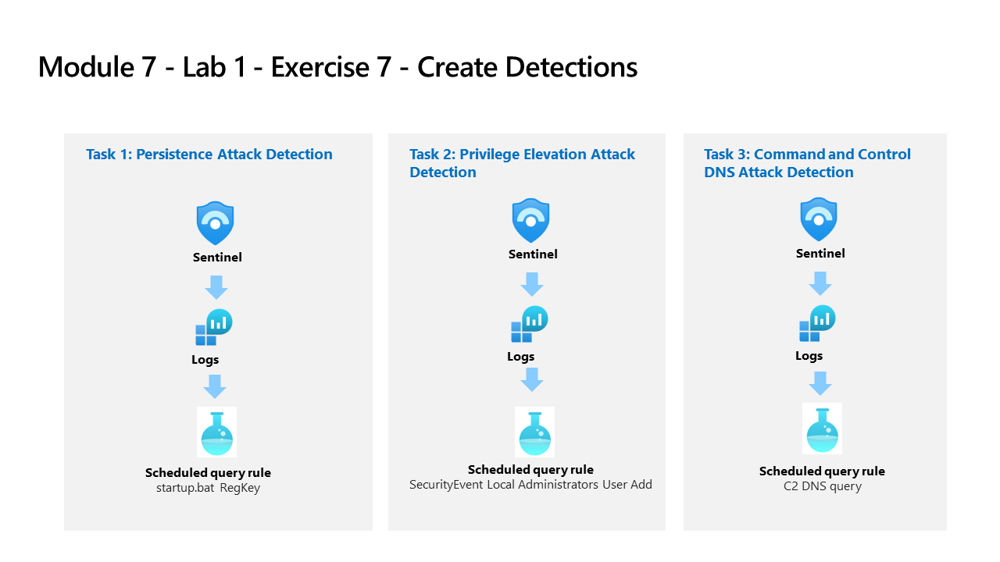

---
lab:
  title: 'Exercício 7: criar detecções'
  module: Learning Path 9 - Create detections and perform investigations using Microsoft Sentinel
---

# Roteiro de aprendizagem 9 – Laboratório 1 – Exercício 7 – Criar Detecções

## Cenário do laboratório



Você é um analista de operações de segurança que trabalha em uma empresa que implementou o Microsoft Sentinel. Você trabalhará com consultas KQL do Log Analytics e, a partir daí, criará regras de análise personalizadas para ajudar a descobrir ameaças e comportamentos anômalos em seu ambiente.

As regras de análise procuram eventos ou conjuntos de eventos específicos no ambiente, emitem alertas quando determinados limites ou condições de evento são atingidos, geram incidentes para que o SOC faça a triagem e a investigação e respondem às ameaças com processos automatizados de acompanhamento e correção.

>**Importante:** os exercícios de laboratório para o Roteiro de Aprendizagem 9 estão em um ambiente *independente*. Se você sair do laboratório antes de concluí-lo, será necessário executar as configurações novamente.

### Tempo estimado para concluir este laboratório: 30 minutos

### Tarefa 1: detecção de ataque de persistência

>**Importante:** As próximas etapas são feitas em uma máquina diferente daquela que você estava trabalhando anteriormente. Procure as referências de nome da máquina virtual.

Nesta tarefa, você criará uma detecção para o primeiro ataque do exercício anterior.

>**Observação:** o Microsoft Sentinel foi pré-implantado em sua assinatura do Azure com o nome **defenderWorkspace** e as soluções necessárias do *hub de conteúdo* foram instaladas.

1. Faça logon na máquina virtual WIN1 como Administrador com a senha: **Pa55w.rd**.  

1. No navegador Edge, acesse o portal do Azure em <https://portal.azure.com>.

1. Na caixa de diálogo **Entrar**, copie e cole a conta de **email do locatário** fornecida pelo provedor de hospedagem do laboratório e selecione **Avançar**.

1. Na caixa de diálogo **Inserir senha**, copie e cole a **Senha de locatário** fornecida pelo provedor de hospedagem do laboratório e selecione **Entrar**.

1. Na barra de Pesquisa do portal do Azure, digite *Sentinel* e selecione **Microsoft Sentinel**.

1. Selecione o **defenderWorkspace** do Microsoft Sentinel.

1. Na seção **Geral**, selecione *Logs*.

1. **Execute** a seguinte instrução KQL novamente para recuperar as tabelas em que temos esses dados:

    ```KQL
    search "temp\\startup.bat"
    ```

    >**Observação:** um resultado com o evento pode levar até 5 minutos para aparecer. Espere até que isso aconteça. Se ele não aparecer, certifique-se de ter reiniciado o WINServer conforme o exercício anterior e de ter concluído a Tarefa 3 do Laboratório do Roteiro de aprendizagem 6, Exercício 2.

1. A tabela *SecurityEvent* parece ter os dados já normalizados e fáceis de serem consultados. Expanda a linha para ver todas as colunas relacionadas ao registro.

1. Com base nos resultados, sabemos agora que o Ator da ameaça está usando o reg.exe para adicionar chaves à chave do Registro e que o programa está localizado em C:\temp. **Execute** a instrução a seguir para substituir o operador *search* pelo operador *where* em nossa consulta:

    ```KQL
    SecurityEvent 
    | where Activity startswith "4688" 
    | where Process == "reg.exe" 
    | where CommandLine startswith "REG" 
    ```

1. É importante ajudar o analista do centro de operações de segurança fornecendo o máximo de contexto possível sobre o alerta. Isso inclui projetar Entidades para uso no gráfico de investigação. **Execute** a seguinte consulta:

    ```KQL
    SecurityEvent 
    | where Activity startswith "4688" 
    | where Process == "reg.exe" 
    | where CommandLine startswith "REG" 
    | extend timestamp = TimeGenerated, HostCustomEntity = Computer, AccountCustomEntity = SubjectUserName
    ```

1. Agora que você tem uma boa regra de detecção, na janela Logs, selecione a **+ Nova regra de alerta** na barra de comandos e depois selecione **Criar alerta do Microsoft Sentinel**. Isso criará uma nova regra Agendada. **Dica:** talvez seja necessário selecionar o botão de reticências (...) na barra de comandos.

1. Isso abrirá o "Assistente de regra de análise". Para a regra *Geral*, digite:

    |Configuração|Valor|
    |---|---|
    |Nome|RegKey de inicialização|
    |Descrição|RegKey de inicialização em c:\temp|
    |Táticas|Persistência|
    |Severidade|Alto|

1. Clique no botão **Avançar: Definir lógica da regra >**.

1. Na guia *Definir lógica de regra*, a *Consulta de regra* já deverá estar preenchida com sua consulta KQL.

1. Configure as entidades em *Aprimoramento de alerta – Mapeamento de entidade* usando os parâmetros na tabela abaixo.

    |Entity|Identificador|Campo de dados|
    |:----|:----|:----|
    |Conta|FullName|AccountCustomEntity|
    |Host|Nome do host|HostCustomEntity|

1. Para *Agendamento de consulta*, defina o seguinte:

    |Configuração|Valor|
    |---|---|
    |Executar consulta a cada|5 minutos|
    |Dados de pesquisa a partir do último|1 dia|

    >**Observação:** estamos gerando propositalmente muitos incidentes para os mesmos dados. Isso permite que o Laboratório use esses alertas.

1. Deixe o restante das opções com os padrões. Clique no botão **Avançar: Configurações de incidente >**.

1. Para a guia *Configurações de incidente*, deixe os valores padrão e clique no botão **Avançar: Resposta automatizada >**.

1. Na guia *Resposta automatizada*, em *Regras de automação*, selecione **Adicionar novo**.

1. Use as configurações na tabela para configurar a regra de automação.

    |Configuração|Valor|
    |:----|:----|
    |Nome da regra de automação|RegKey de inicialização|
    |Gatilho|Quando o incidente é criado|
    |Ações |Executar guia estratégico|
    |guia estratégico |Defender_XDR_Ransomware_Playbook_SecOps-Tasks|

    >**Observação:** você já atribuiu permissões ao guia estratégico, então ele estará disponível.

1. Selecione **Aplicar**

1. Selecione o botão **Próximo: Revisar + criar >**.
  
1. Na guia *Revisar e criar*, selecione o botão **Salvar** para criar a regra de Análise Agendada.

### Tarefa 2: detecção de ataque de elevação de privilégio

Nesta tarefa, você criará uma detecção para o segundo ataque do exercício anterior.

1. No portal do Microsoft Sentinel, selecione **Logs** na seção Geral caso você tenha navegado para fora desta página.

1. **Execute** a seguinte instrução KQL para identificar qualquer entrada que se refira a administradores:

    ```KQL
    search "administrators" 
    | summarize count() by $table
    ```

1. O resultado pode mostrar eventos de tabelas diferentes, mas, no nosso caso, queremos investigar a tabela SecurityEvent. O EventID e o evento que estamos procurando é "4732 – Um membro foi adicionado a um grupo local habilitado para segurança". Com isso, identificaremos a adição de um membro a um grupo privilegiado. **Execute** a seguinte consulta KQL para confirmar:

    ```KQL
    SecurityEvent 
    | where EventID == 4732
    | where TargetAccount == "Builtin\\Administrators"
    ```

1. Expanda a linha para ver todas as colunas relacionadas ao registro. O nome de usuário da conta adicionada como Administrador não aparece. O problema é que, em vez de armazenar o nome de usuário, temos o Identificador de segurança (SID). **Execute** o seguinte KQL para corresponder o SID ao nome de usuário que foi adicionado ao grupo Administradores:

    ```KQL
    SecurityEvent 
    | where EventID == 4732
    | where TargetAccount == "Builtin\\Administrators"
    | extend Acct = MemberSid, MachId = SourceComputerId  
    | join kind=leftouter (
        SecurityEvent 
        | summarize count() by TargetSid, SourceComputerId, TargetUserName 
        | project Acct1 = TargetSid, MachId1 = SourceComputerId, UserName1 = TargetUserName) on $left.MachId == $right.MachId1, $left.Acct == $right.Acct1
    ```

   

1. Estenda a linha para mostrar as colunas resultantes. Na última, vemos o nome do usuário adicionado na coluna *UserName1* que *projetamos* na consulta KQL. É importante ajudar o analista de operações de segurança fornecendo o máximo de contexto possível sobre o alerta. Isso inclui projetar Entidades para uso no gráfico de investigação. **Execute** a seguinte consulta:

    ```KQL
    SecurityEvent 
    | where EventID == 4732
    | where TargetAccount == "Builtin\\Administrators"
    | extend Acct = MemberSid, MachId = SourceComputerId  
    | join kind=leftouter (
        SecurityEvent 
        | summarize count() by TargetSid, SourceComputerId, TargetUserName 
        | project Acct1 = TargetSid, MachId1 = SourceComputerId, UserName1 = TargetUserName) on $left.MachId == $right.MachId1, $left.Acct == $right.Acct1
    | extend timestamp = TimeGenerated, HostCustomEntity = Computer, AccountCustomEntity = UserName1
    ```

1. Agora que você tem uma boa regra de detecção, na janela Logs, selecione a **+ Nova regra de alerta** na barra de comandos e depois selecione **Criar alerta do Microsoft Sentinel**. **Dica:** talvez seja necessário selecionar o botão de reticências (...) na barra de comandos.

1. Isso abrirá o "Assistente de regra de análise". Para a regra *Geral*, digite:

    |Configuração|Valor|
    |---|---|
    |Nome|**Adição de usuários administradores locais do evento de segurança**|
    |Descrição|**Usuário adicionado ao grupo de administradores locais**|
    |Táticas|**Elevação de privilégio**|
    |Severidade|**Alta**|

1. Clique no botão **Avançar: Definir lógica da regra >**.

1. Na guia *Definir lógica de regra*, a *Consulta de regra* já deve estar preenchida com a consulta KQL, bem como as entidades em *Aprimoramento de alerta – Mapeamento de entidade*.

    |Entity|Identificador|Campo de dados|
    |:----|:----|:----|
    |Conta|FullName|AccountCustomEntity|
    |Host|Nome do host|HostCustomEntity|

1. Se a opção **Nome do host** não estiver selecionada em *Entidade de Host*, selecione-a na lista suspensa e use os parâmetros da tabela anterior para preencher os campos.

1. Para *Agendamento de consulta*, defina o seguinte:

    |Configuração|Valor|
    |---|---|
    |Executar consulta a cada|5 minutos|
    |Dados de pesquisa a partir do último|1 dia|

    >**Observação:** estamos gerando propositalmente muitos incidentes para os mesmos dados. Isso permite que o Laboratório use esses alertas.

1. Deixe o restante das opções com os padrões. Clique no botão **Avançar: Configurações de incidente >**.

1. Para a guia *Configurações de incidente*, deixe os valores padrão e clique no botão **Avançar: Resposta automatizada >**.

1. Na guia *Resposta automatizada*, em *Regras de automação*, selecione **Adicionar novo**.

1. Use as configurações na tabela para configurar a regra de automação.

   |Configuração|Valor|
   |:----|:----|
   |Nome da regra de automação|Adição de usuários administradores locais do evento de segurança|
   |Gatilho|Quando o incidente é criado|
   |Ações |Executar guia estratégico|
   |guia estratégico |PostMessageTeams-OnIncident|

   >**Observação:** você já atribuiu permissões ao guia estratégico, então ele estará disponível.

1. Selecione **Aplicar**

1. Clique no botão **Avançar: Examinar e criar >**.
  
1. Na guia *Examinar e criar*, selecione o botão **Criar** para criar a nova regra de Análise agendada.

## Prossiga para o Exercício 8
